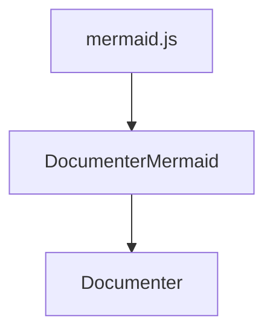

# OkinawaCompPhysFoodSurvey2024

Documentation for [OkinawaCompPhysFoodSurvey2024](https://github.com/terasakisatoshi/OkinawaCompPhysFoodSurvey2024.jl).

```@index
```



# 好きな食べ物

```@example wc_food
using ImageShow
using WordCloud
using StatsBase

using OkinawaCompPhysFoodSurvey2024
df = OkinawaCompPhysFoodSurvey2024.summarize()
words = collect(countmap(df.food))
wc_favorite_food = wordcloud(words, fonts=["Juisee HW:style=Regular"])
generate!(wc_favorite_food)
paint(wc_favorite_food, "wc_favorite_food.svg")
```


下記の例はランダムな文字を突っ込んだ例です．人間の皆さん頑張って負けないようにしましょう！

```@example wc_random
using Random: randstring

using ImageShow
using WordCloud

wc_random = wordcloud( [randstring('a':'z', 7) for _ in 1:100])
generate!(wc_random)
paint(wc_random, "wc_random.svg")
```


